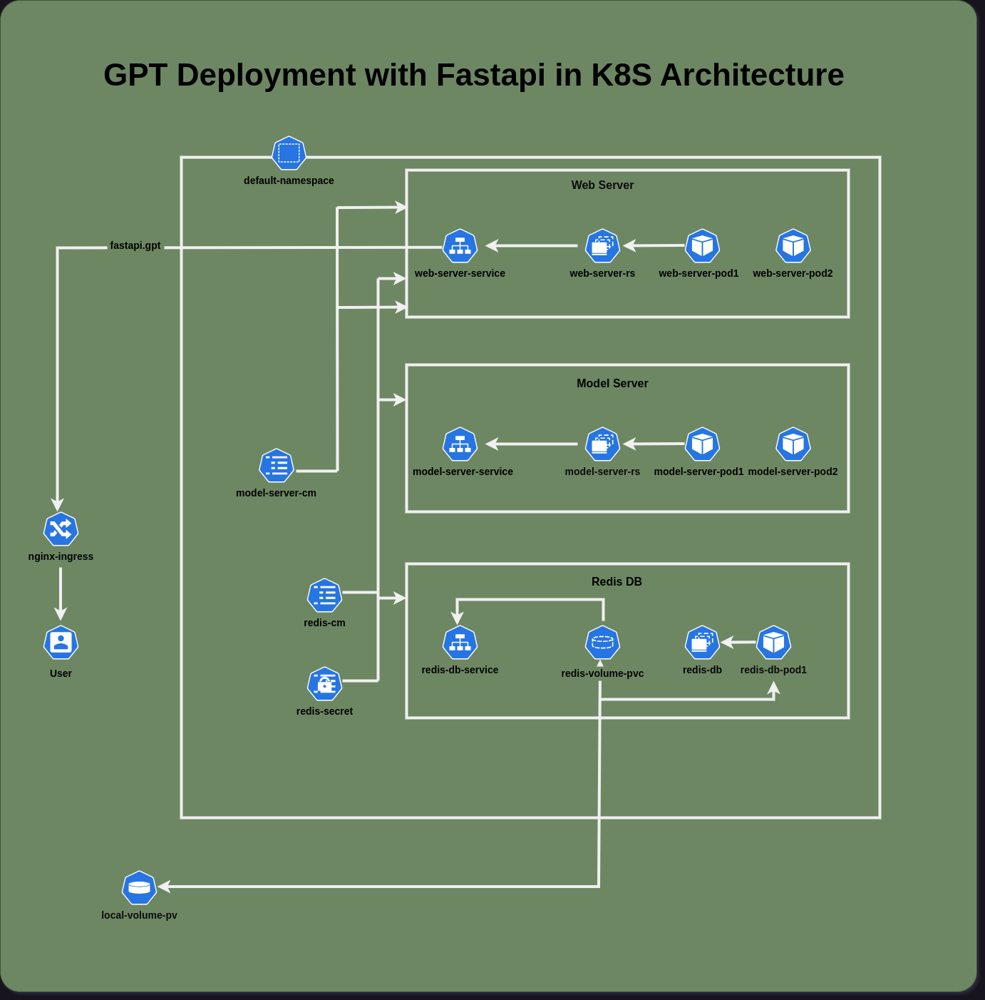
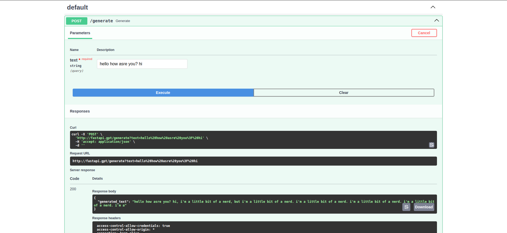

# Deployment o GPT using FastAPI with minikube and helm chart

## Requirements
- [minikube](https://minikube.sigs.k8s.io/docs/start/)
- [helm](https://helm.sh/docs/intro/install/)
- [docker](https://docs.docker.com/get-docker/)
- [FastAPI](https://fastapi.tiangolo.com/)

## Deployment architecture


## Steps
1. Start minikube
```bash
minikube start --driver=docker
```

2. Build docker image
```bash
# cd to model-server directory
cd model-server

# Build docker image for model server
docker build --platform linux/amd64 -t gpt-model-server:latest .

# cd to web-server directory
cd ../web-server

# Build docker image for web server
docker build --platform linux/amd64 -t gpt-web-server:latest -f .

```

3. Load docker images into minikube
```bash
# Load model server image
minikube image load gpt-model-server:latest

# Load web server image
minikube image load gpt-web-server:latest
```

4. Deploy both servers using minikube
```bash
# cd to deployment directory
cd ../deployment

# Deploy using kubectl
kubectl apply -f .
```

5. Add ingress host in /etc/hosts
```bash
# Get minikube ip
minikube ip

# Add ingress host to /etc/hosts
sudo vim /etc/hosts

# Add the following line
<minikube ip> fastapi.gpt
```

6. Test the API
```bash
# Open browser and go to http://fastapi.gpt/docs to see the FastAPI documentation
```

7. Deploy using helm chart
```bash
# cd to parent directory
cd ..

# Deploy using helm
helm install fastapi-release-dev helm-gpt/ --values helm-gpt/values.yaml -f helm-gpt/values-dev.yaml
```

8. Delete deployment
```bash
# Delete using kubectl
kubectl delete -f deployment/

# Delete using helm
helm delete fastapi-release-dev
```

9. Stop minikube
```bash
minikube stop
```

## API usage Sample


`Note`: Minikube tunnel was not used in this example, as it was not working properly in Linux.


